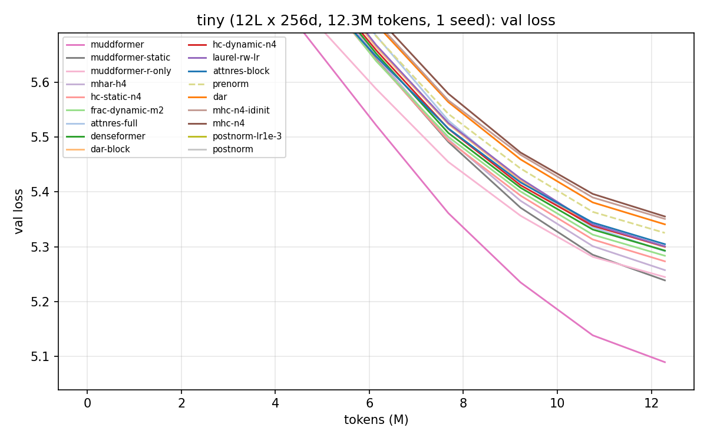
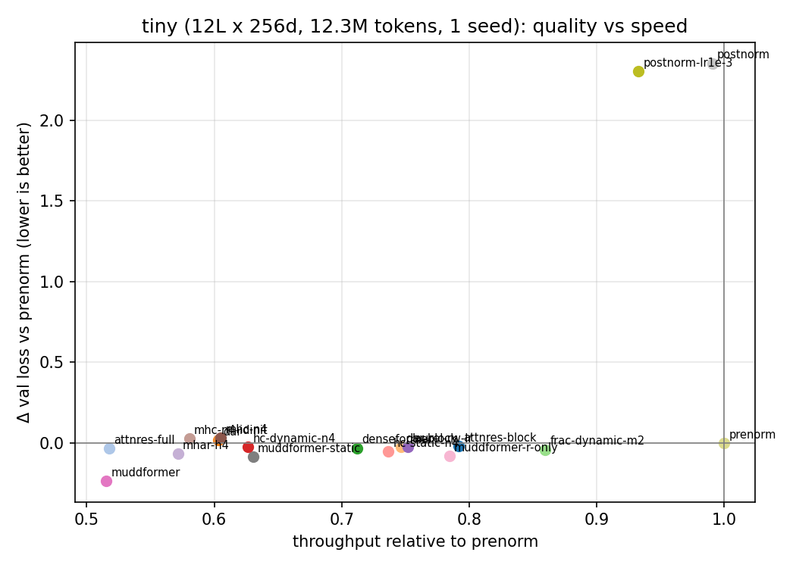

# Hyper-Connection Factory

**One transformer body, every residual wiring.** Hyper-Connection Factory implements the
recent family of "beyond `x + f(x)`" residual connections for decoder LLMs behind a single
interface, trains them under an identical recipe, and reports the comparison.

Every variant shares **exactly** the same attention / MLP sublayers, initialisation, data,
optimizer and schedule. The only thing that changes is the `Connection` module: what each
sublayer reads and how its output is written back. So differences in the results are due
to the wiring and nothing else.

| key | method | paper | what changes | extra params | = pre-norm at init |
|---|---|---|---|---|---|
| `prenorm` | Pre-Norm residual | Xiong et al. 2020 | `h ← h + f(norm(h))` | 0 | — |
| `postnorm` | Post-Norm residual | Vaswani et al. 2017 | `h ← norm(h + f(h))` | 2L·d | ✗ |
| `hc` | Hyper-Connections (static / dynamic) | [Zhu et al., ICLR'25](https://arxiv.org/abs/2409.19606) | n parallel residual streams; learned read (A_m), write (B) and stream mixing (A_r) | n(n+2); dynamic adds d(n+2) + 2d (LayerNorm) + 2 | ✓ |
| `mhc` | Manifold-Constrained HC | [Xie et al. (DeepSeek), ICML'26](https://arxiv.org/abs/2512.24880) | HC with σ-gated read/write and a **doubly-stochastic** (Sinkhorn) stream-mixing matrix; learned read-out head | nd·n(n+2) + n(n+2) + 3 per sublayer, plus an n·nd read-out head | ✗ |
| `frac` | Frac-Connections | [Zhu et al., 2025](https://arxiv.org/abs/2503.14125) | HC without widening: split d into m fractions | 2m² + m; dynamic adds (d/m)(2m+3) + 2 | ✓ |
| `denseformer` | DenseFormer (DWA) | [Pagliardini et al., NeurIPS'24](https://arxiv.org/abs/2402.02622) | after each block, a learned static weighted average of all previous block outputs | O(L²) scalars | ✓ |
| `muddformer` | MUDDFormer | [Xiao et al., ICML'25](https://arxiv.org/abs/2502.12170) | **dynamic, per-token** dense weights, separately for Q, K, V and residual streams | small MLP per block | ✓ |
| `laurel` | LAuReL (RW / LR / RW+LR) | [Menghani et al., ICML'25](https://arxiv.org/abs/2411.07501) | learned residual weights and a low-rank skip path `x + xAB` | 2 + 2dr per sublayer | ✓ |
| `attnres` | Attention Residuals (Full / Block) | [Kimi Team, 2026](https://arxiv.org/abs/2603.15031) | **replace** the residual sum with softmax attention over previous sublayer outputs (depth attention) | 2d per sublayer (query + key-norm weight), plus one final router | ✗ (uniform avg) |
| `mhar` | Multi-Head Attention Residuals | [Luo et al., 2026](https://arxiv.org/abs/2607.27230) | AttnRes with H independent depth softmaxes (one per channel group) | 2d per sublayer, plus one final router | ✗ |
| `dar` | Delta Attention Residuals (per-sublayer / Block) | Luo et al., 2026 | keep the residual stream; **add** depth-routed deltas; optional zero-init gate | 2d per sublayer (+1 gate) | ✓ with `gate: zero` |

"= pre-norm at init" means that with the paper's initialisation the variant computes exactly the
same function as the pre-norm baseline. This is checked by
`tests/test_connections.py::test_equivalent_to_prenorm_at_init`.

## Results

### Tiny scale (laptop)

12 layers, d=256, 9.6M non-embedding params, 12.3M FineWeb-Edu tokens, **1 seed**,
Apple M3 Pro (fp32, MPS). Validation loss is measured on a fixed set of 40×24×256 tokens.
Throughput is relative to pre-norm **on MPS**; GPU ratios will differ, especially after `torch.compile`.

| # | variant | val loss | Δ vs prenorm | params (non-emb) | +conn params | throughput (rel.) | 
|---|---|---|---|---|---|---|
| 1 | muddformer | 5.0896 | -0.2356 | 9.86M | 217.5K | 0.52× |
| 2 | muddformer-static | 5.2387 | -0.0865 | 9.65M | 0.3K | 0.63× |
| 3 | muddformer-r-only | 5.2447 | -0.0804 | 9.84M | 202.5K | 0.78× |
| 4 | mhar-h4 | 5.2574 | -0.0678 | 9.65M | 12.8K | 0.57× |
| 5 | hc-static-n4 | 5.2734 | -0.0518 | 9.64M | 0.6K | 0.74× |
| 6 | frac-dynamic-m2 | 5.2836 | -0.0416 | 9.66M | 21.8K | 0.86× |
| 7 | attnres-full | 5.2918 | -0.0334 | 9.65M | 12.8K | 0.52× |
| 8 | denseformer | 5.2929 | -0.0322 | 9.64M | 0.1K | 0.71× |
| 9 | dar-block | 5.2995 | -0.0257 | 9.65M | 12.3K | 0.75× |
| 10 | hc-dynamic-n4 | 5.3001 | -0.0250 | 9.69M | 49.8K | 0.63× |
| 11 | laurel-rw-lr | 5.3006 | -0.0245 | 9.84M | 196.7K | 0.75× |
| 12 | attnres-block | 5.3046 | -0.0205 | 9.65M | 12.8K | 0.79× |
| 13 | prenorm | 5.3252 | +0.0000 | 9.64M | 0.0K | 1.00× |
| 14 | dar | 5.3408 | +0.0156 | 9.65M | 12.3K | 0.60× |
| 15 | mhc-n4-idinit | 5.3507 | +0.0255 | 10.23M | 594.6K | 0.58× |
| 16 | mhc-n4 | 5.3551 | +0.0300 | 10.23M | 594.6K | 0.61× |
| 17 | postnorm-lr1e-3 | 7.6286 | +2.3035 | 9.64M | 6.1K | 0.93× |
| 18 | postnorm | 7.6768 | +2.3517 | 9.64M | 6.1K | 0.99× |




What this run shows, and what it does not:

* **MUDDFormer is far ahead (−0.236).** Its two ingredients are complementary. Static weights
  only (`muddformer-static`, −0.087) and a single dynamic R stream (`muddformer-r-only`,
  −0.080) each recover only about a third of the gain.
* **Depth attention needs heads.** MHAR (−0.068) beats single-head AttnRes (−0.033), and full
  AttnRes beats block AttnRes (−0.021).
* **Cheap wins.** Static HC (−0.052, 0.6K extra params) and DenseFormer (−0.032, 0.1K) help
  with almost no parameters. Frac-Connections has the smallest slowdown (0.86×).
* **mHC is worse than pre-norm here** (+0.030), including with a stream-preserving init
  (`mhc-n4-idinit`, +0.026). Its initialisation is unpublished, see the implementation notes.
* **Post-norm** collapses to the unigram loss (≈7.6) at lr 3e-3 and 1e-3. A 300-step check shows
  it trains at 3e-4. This is the known post-LN instability, not a bug, and a full lr 3e-4 run is
  pending.
* **Caveats.** One seed, 12.3M tokens, 9.6M params. Seed noise is still being measured (extra
  seeds for pre-norm and MUDDFormer are pending), so differences of a few hundredths among the
  middle of the table are **not yet resolved**.

## Quickstart

```bash
pip install -e .                      # pip >= 21.3; torch >= 2.4, numpy, pyyaml, tiktoken, matplotlib
pytest tests/                         # every variant: shapes, grads, causality, init-equivalence

# data: GPT-2 BPE tokens in flat uint16 shards
python -m hcfactory.prepare_data --dataset fineweb-edu --train-tokens 20_000_000 --val-tokens 1_000_000

# train one variant
python -m hcfactory.train --config configs/tiny.yaml connection=hc connection_kwargs.n=4

# train the whole comparison set, then build the table + plots
python scripts/sweep.py   --config configs/tiny.yaml --variants configs/variants.yaml
python scripts/compare.py runs/tiny --out results/tiny
```

### Using a connection in your own model

```python
from hcfactory import GPT, ModelConfig

cfg = ModelConfig(n_layer=12, d_model=768, n_head=12,
                  connection="mhar", connection_kwargs={"heads": 4})
model = GPT(cfg)
logits, loss = model(idx, targets)
```

## Training template

`hcfactory/train.py` is a single-file nanoGPT-style trainer shared by all variants:

* single device (CUDA / MPS / CPU) or multi-GPU DDP through `torchrun`
* bf16 autocast on CUDA, optional `torch.compile`, gradient accumulation
* AdamW. Connection parameters (gates, depth queries, mixing matrices) get **no weight decay**,
  because decaying them biases every variant back towards "no mixing". They can get their
  own LR multiplier (`connection_lr_mult`).
* cosine or WSD (warmup-stable-decay) schedule, gradient clipping, divergence detection
* evaluation on a **fixed** set of validation batches, identical for every variant
* logs: `runs/<sweep>/<run>/{config.json, log.jsonl, summary.json}`, plus optional W&B

Any config key can be overridden from the CLI (`key=value`, nested `a.b=value`).

| config | size | tokens | hardware |
|---|---|---|---|
| `configs/tiny.yaml` | 12L × 256d, 9.6M | 12.3M | laptop / 1 GPU, ~25 min per variant on MPS |
| `configs/gpt124m.yaml` | 12L × 768d, GPT-2 small | 2.6B | 8 GPUs (DDP) |
| `configs/gpt350m.yaml` | 24L × 1024d | 7.9B | 8 GPUs (DDP) |

```bash
# 8 GPUs, one variant per GPU in parallel (good for 124M)
python scripts/sweep.py --config configs/gpt124m.yaml --gpus 0,1,2,3,4,5,6,7 grad_accum=8
# or each variant on all 8 GPUs, one after another
python scripts/sweep.py --config configs/gpt124m.yaml --nproc 8
# multiple seeds: re-run with seed=1, seed=2; compare.py reports mean ± std
python scripts/sweep.py --config configs/gpt124m.yaml --nproc 8 seed=1
```

`scripts/bench.py` measures throughput and memory of every variant without any data.

## Adding a variant

```python
# hcfactory/connections/my_variant.py
from .base import Connection

class MyConnection(Connection):
    def __init__(self, cfg, alpha: float = 1.0):
        super().__init__(cfg)
        ...                                  # per-sublayer parameters

    def forward(self, x0, sublayers):        # x0: [B, T, D] token embedding
        h = x0
        for f in sublayers:                  # 2L sublayers: attn, mlp, attn, mlp, ...
            h = h + f(h)                     # f(x) = sublayer(norm(x))
        return h                             # goes to final norm + LM head
```

Register it in `hcfactory/connections/__init__.py`, add it to `tests/test_connections.py`
and `configs/variants.yaml`. Class attributes let a connection change the body:
`sublayer_prenorm = False` removes the sublayers' input norms (Post-Norm), and
`qkv_streams = True` lets attention take separate Q/K/V inputs (MUDDFormer).

## Implementation notes and fidelity

Each implementation follows the paper's equations and, where one exists, the official code.
The choices below are ones the papers leave open, so we decided them ourselves:

* **HC**: `layer_id` for the one-hot A_m init counts *sublayers* (attention and FFN each
  count as one layer, as in the paper). The dynamic branch uses LayerNorm (per the paper's
  pseudo-code). Streams are collapsed by summation.
* **mHC**: equations follow the paper and DeepSeek-V4's reference `inference/model.py`:
  norm-free RMS scaling of vec(H), pre `σ(·)`, post `2σ(·)`, row-softmax-first Sinkhorn
  (20 iters), and a learned sigmoid "HyperHead" read-out. The **initialisation of φ and b is
  not published**. We use φ ~ N(0, 0.02²) and b = 0 (uniform doubly-stochastic mixing at
  start). Both are exposed as kwargs (`phi_std`, `res_bias_diag`).
* **Frac-Connections**: m×2m mixing, LayerNorm over each d/m fraction, Y = A_r = I, B = 1 at init.
* **DenseFormer**: dilation supported, period fixed to 1.
* **MUDDFormer**: DA weights from `GELU(RMSNorm(X_i) W1) W2 + a_i` with W2 = 0 and a_i one-hot.
  The last layer produces only the R stream, with hidden width ×4. Not included:
  PrePostDANorm and the depth-varying FFN width.
* **LAuReL**: applied per sublayer. The RW weights are bounded as `(α, β) = 2·softmax(w)`
  (α = β = 1 at init). The paper asks for a bounding map but does not fix one. LR uses the
  paper's "column orthogonal" A init and B = 0. PA is not implemented.
* **AttnRes**: zero-init pseudo-query per sublayer, RMSNorm on keys, a final routing step
  over all sources before the output norm. Block mode keeps completed-block sums plus the
  current partial sum. The RMSNorm key weight is folded into the query (same function,
  normalised keys computed once per source).
* **DAR**: the Delta Block source is the true block delta `h_end − h_start`. The released code
  uses a recursive difference; see the DAR paper, appendix.

Found a discrepancy with a paper? Please open an issue. Faithful reproduction is the point.

## Repository layout

```
hcfactory/
  model.py                 shared Llama-style body (RoPE, SwiGLU, RMSNorm) + GPT wrapper
  connections/
    base.py                Connection interface, rms(), sinkhorn()
    residual.py            prenorm, postnorm
    hyper.py               hc, mhc, frac
    dense.py               denseformer, muddformer
    laurel.py              laurel
    depth_attention.py     attnres, mhar, dar
  train.py                 training template
  data.py, prepare_data.py data pipeline
configs/                   tiny / gpt124m / gpt350m + the variant list
scripts/                   sweep.py, compare.py, bench.py
tests/                     correctness tests for every variant
results/                   committed result tables and plots
```

## Citation

If you use this repository, please cite the original papers of the methods you compare
(links above), and optionally:

```bibtex
@software{hyperconnectionfactory2026,
  title  = {Hyper-Connection Factory: unified implementations and comparisons of residual-connection variants for LLMs},
  author = {Luo, Cheng},
  year   = {2026},
  url    = {https://github.com/wdlctc/hyper-connection-factory}
}
```

## License

MIT
